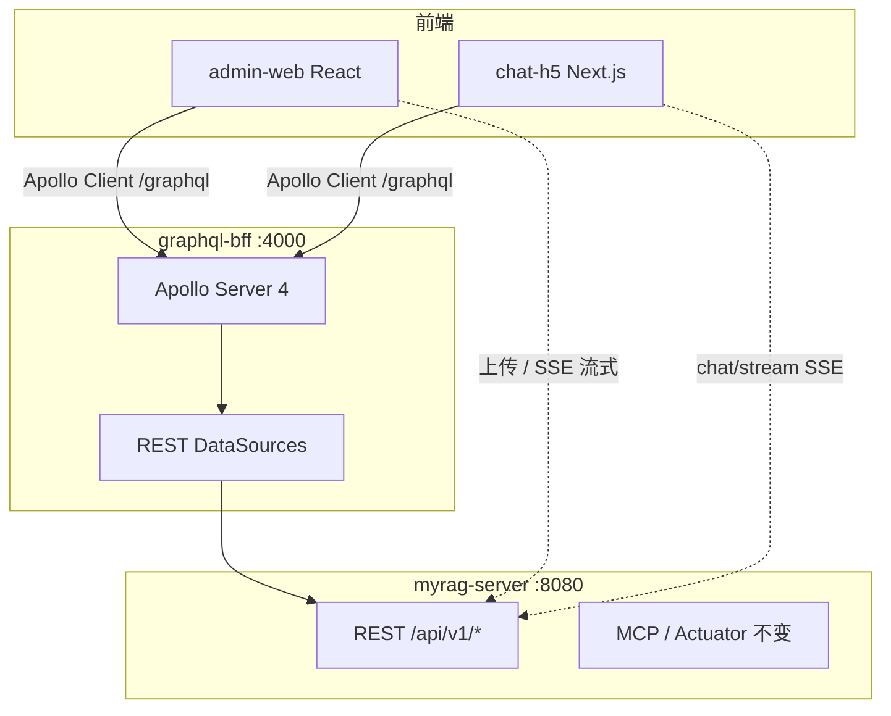

# Apollo GraphQL BFF 迁移方案

> 状态：**已实现**（GraphQL BFF + admin-web Apollo Client + chat-h5 非流式 GraphQL）
> 选型：Node.js Apollo Server BFF + 渐进式迁移，Spring Boot REST 保持不变

## 架构



## 模块结构

```
graphql-bff/
├── package.json
├── tsconfig.json
├── Dockerfile
└── src/
    ├── index.ts
    ├── schema/typeDefs.ts
    ├── resolvers/index.ts
    └── datasources/restClient.ts
```

## REST → GraphQL 映射

### Query

| REST | GraphQL |
|------|---------|
| `GET /admin/knowledge-bases` | `knowledgeBases` |
| `GET /admin/knowledge-bases/{kbId}/documents` | `documents(kbId)` |
| `GET /admin/system-prompt` | `systemPrompt` |
| `GET /admin/ai-config` | `aiConfig` |
| `GET /admin/monitor/metrics` | `monitorMetrics` |
| `GET /admin/monitor/recall-logs` | `recallLogs(kbId, page, size)` |
| `GET /admin/monitor/chat-logs` | `chatLogs(page, size)` |
| `GET /admin/monitor/cache-logs` | `cacheLogs(page, size)` |
| `GET /admin/monitor/alerts` | `alerts` |
| `GET /rag/knowledge-bases` | `activeKnowledgeBases` |
| `POST /rag/search` | `ragSearch(input)` |
| — | `health` |

### Mutation

| REST | GraphQL |
|------|---------|
| `POST /admin/knowledge-bases` | `createKnowledgeBase(input)` |
| `PUT /admin/knowledge-bases/{id}` | `updateKnowledgeBase(id, input)` |
| `DELETE /admin/knowledge-bases/{id}` | `deleteKnowledgeBase(id)` |
| `DELETE /admin/documents/{docId}` | `deleteDocument(docId)` |
| `POST /admin/documents/{docId}/reindex` | `reindexDocument(docId)` |
| `PUT /admin/system-prompt` | `updateSystemPrompt(prompt)` |
| `PUT /admin/ai-config` | `updateAiConfig(input)` |
| `POST /admin/recall-test` | `recallTest(input)` |
| `DELETE /admin/monitor/cache` | `clearCache` |
| `POST /chat` | `chat(input)` |

### 保留 REST（不迁移 GraphQL）

| 能力 | 路径 | 原因 |
|------|------|------|
| 文档上传 | `POST /admin/knowledge-bases/{kbId}/documents` | multipart |
| SSE 流式聊天 | `POST /chat/stream` | SSE 复杂度高 |
| MCP | `/mcp/message` | 独立协议 |
| Actuator | `/actuator/*` | 运维 |

## 环境变量

```bash
REST_BASE_URL=http://localhost:8080   # BFF 转发目标
PORT=4000
GRAPHQL_BFF_PORT=4000                 # docker-compose 映射
```

## 实施阶段

| 阶段 | 内容 | 状态 |
|------|------|------|
| Phase 0 | graphql-bff 脚手架 + Docker + `/graphql` 代理 | 完成 |
| Phase 1 | Admin 读/写 resolver；admin-web Apollo Client；KB + SystemConfig | 完成 |
| Phase 2 | RAG/监控 resolver；Documents/RecallTest/Monitor/ChatLogs | 完成 |
| Phase 3 | chat Mutation；chat-h5 非流式走 GraphQL | 完成 |
| Phase 4 | 下线前端 REST（除 Upload/SSE）；更新 API 文档 | 部分（Upload/SSE 仍 REST） |

## 涉及文件清单

| 文件 | 变更 |
|------|------|
| `graphql-bff/**` | 新建 |
| `docker-compose.yml` | 新增 `graphql-bff` 服务 |
| `admin-web/nginx.conf` | 增加 `/graphql` 反代 |
| `admin-web/vite.config.ts` | `/graphql` → `:4000` |
| `admin-web/package.json` | `@apollo/client`, `graphql` |
| `admin-web/src/apollo/client.ts` | 新建 |
| `admin-web/src/api/client.ts` | GraphQL 替代 REST（upload 除外） |
| `chat-h5/next.config.js` | `/graphql` rewrite |
| `scripts/dev-all.sh` | 启动 graphql-bff |
| `.env.example` | `REST_BASE_URL`, `GRAPHQL_BFF_PORT` |
| `docs/deploy/quickstart.md` | GraphQL 启动说明 |
| `docs/api/README.md` | GraphQL 章节 |

## BFF 错误处理

Spring 返回 `{ code, message, data }`；`code !== 0` 时 BFF 抛 `GraphQLError`，`extensions.code` 映射业务错误码。

## 分页

Spring `Page<T>` 原样透传为 GraphQL 类型（含 `content`、`totalElements` 等），前端无需改 Table 数据结构。
