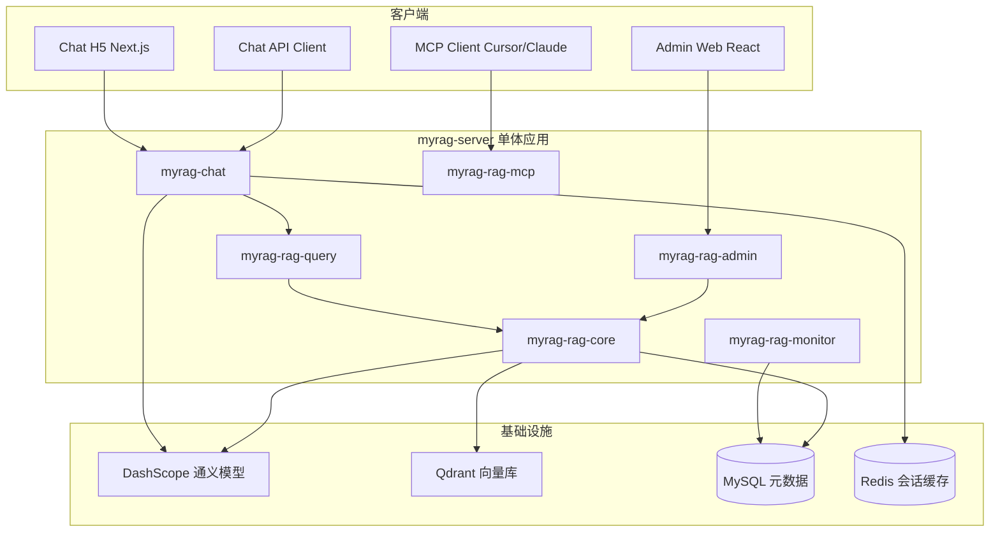

# 架构与实施计划

> 本文档描述 MyRAG 的整体架构、模块划分与实施阶段。

## 总体架构

采用 **Maven 多模块单体**，一个 Spring Boot 进程启动全部能力，模块边界清晰，后期可按模块拆分微服务。



## 模块划分

| 模块 | 职责 |
|------|------|
| `myrag-common` | 公共 DTO、异常、常量、配置属性 |
| `myrag-rag-core` | Qdrant 混合检索、文档解析/分块/入库、Embedding |
| `myrag-rag-query` | 对外 REST 查询 API |
| `myrag-rag-admin` | 知识库/文档/配置 CRUD REST API |
| `myrag-rag-mcp` | MCP Server，暴露检索工具 |
| `myrag-rag-monitor` | 召回日志、指标、质量评估 |
| `myrag-chat` | Chat API、路由小模型、Prompt 防护 |
| `myrag-server` | 启动入口，聚合所有模块 |
| `admin-web` | React + Ant Design 管理后台 |
| `chat-h5` | Next.js 14 用户端 H5 聊天页 |

## 技术栈

- Java 21、Spring Boot 3.4、Spring AI Alibaba 1.1.2
- DashScope（通义 qwen-plus / qwen-turbo / text-embedding-v3）
- Qdrant + BM25 混合检索（RRF 融合）
- MySQL + Flyway、Redis

## 核心数据模型（MySQL）

| 表名 | 说明 |
|------|------|
| `knowledge_base` | 知识库，对应 Qdrant 一个 collection |
| `document` | 上传的文档 |
| `document_chunk` | 分块元数据（向量存 Qdrant） |
| `recall_log` | 召回监控日志 |
| `recall_quality_alert` | 召回质量告警 |
| `system_prompt_config` | 系统 Prompt（仅 Admin 可改） |
| `chat_session` / `chat_message` | 会话持久化（预留） |

## RAG 混合检索流程

Spring AI 标准 `VectorStore` 仅支持 dense 检索，本项目通过 Qdrant Universal Query API 实现混合检索：

1. DashScope `text-embedding-v3` 生成 dense 向量
2. `Bm25SparseEncoder`（HanLP 分词）生成 sparse 向量
3. Qdrant prefetch dense + sparse，RRF 融合返回 Top-K

## Chat 请求流程

1. **PromptGuard** — 注入检测 + 长度校验
2. **RagRouter**（qwen-turbo）— 判断是否需要 RAG、选择知识库
3. **HybridSearch** — 检索上下文
4. **ChatClient**（qwen-plus）— 生成回答（System Prompt 服务端固定，用户不可覆盖）

## 安全防护

| 层级 | 措施 |
|------|------|
| 消息隔离 | System Prompt 由服务端配置，Chat API 不接受 client 传入的 system 字段 |
| 注入检测 | 正则拦截常见 Prompt 注入模式 |
| 上下文边界 | 用户消息 / RAG 上下文有 token 上限 |
| 配置管理 | System Prompt 仅存 DB，仅 Admin API 可修改 |

## 实施阶段

| 阶段 | 内容 | 状态 |
|------|------|------|
| Phase 1 | Maven 多模块、docker-compose、Flyway、DashScope 连通 | 已完成 |
| Phase 2 | 混合检索、文档入库、Query/Admin API | 已完成 |
| Phase 3 | 路由小模型、PromptGuard、Chat API | 已完成 |
| Phase 4 | MCP Server、召回监控、React Admin 前端 | 已完成 |
| Phase 5 | 用户端 H5 聊天页（Next.js 14） | 已完成 |

## 目录结构

```
myrag/
├── pom.xml
├── docker-compose.yml
├── myrag-common/
├── myrag-rag-core/
├── myrag-rag-query/
├── myrag-rag-admin/
├── myrag-rag-mcp/
├── myrag-rag-monitor/
├── myrag-chat/
├── myrag-server/
├── admin-web/
├── chat-h5/
└── docs/
    ├── plan/
    ├── deploy/
    └── api/
```

## 相关计划

- [用户端 H5 聊天页](chat-h5.md)
- [用户问题日志与监控](chat-query-log.md)
