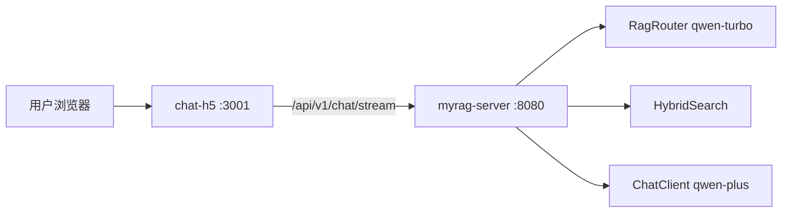

# 用户端 H5 聊天页实施计划

> 面向终端用户的移动端聊天界面，对接后端 Chat API，由服务端自动完成 RAG 路由与检索。

## 目标

- 提供移动端友好的 H5 对话页，用户无需了解知识库或 MCP
- 调用 `POST /api/v1/chat/stream` 实现流式输出
- 与 `admin-web` 并列，独立目录 `chat-h5/`

## 技术选型

| 项 | 选择 |
|----|------|
| 框架 | Next.js 14（App Router） |
| UI | React 18 + Tailwind CSS |
| 端口 | 3001（本地 dev / Docker） |
| API 代理 | `next.config.js` rewrites，`/api` → 后端 8080 |
| Docker | `output: 'standalone'` 多阶段镜像 |

## 架构



H5 **不直接调用 MCP**；路由、知识库选择、检索均由后端 Chat 链路自动完成。

## 目录结构

```
chat-h5/
├── app/
│   ├── layout.tsx      # 根布局、viewport 移动端适配
│   ├── page.tsx        # 入口
│   └── globals.css
├── components/
│   ├── ChatPage.tsx    # 主逻辑：消息列表、发送、流式、新对话
│   ├── ChatMessage.tsx # 消息气泡
│   └── ChatInput.tsx   # 底部输入框
├── lib/
│   ├── api.ts          # chat / chatStream
│   ├── session.ts      # sessionId localStorage
│   └── types.ts
├── next.config.js
├── Dockerfile
└── package.json
```

## 核心行为

### 会话管理

- `sessionId` 首次访问时生成 UUID，存入 `localStorage`（key: `myrag_chat_session_id`）
- 「新对话」按钮重置 sessionId 并清空消息列表

### 流式对话

1. 用户发送消息 → 追加 user / assistant（空内容、streaming）气泡
2. `fetch('/api/v1/chat/stream')` 读取 ReadableStream
3. 兼容 SSE `data:` 前缀与纯文本 chunk
4. 支持「停止」按钮（AbortController）
5. 流式失败时降级调用 `POST /api/v1/chat`

### API 请求体

```json
{
  "sessionId": "uuid",
  "message": "用户问题"
}
```

## Docker 集成

`docker-compose.yml` 新增 `chat-h5` 服务：

- 构建：`chat-h5/Dockerfile`
- 环境变量：`API_URL=http://server:8080`
- 端口映射：`3001:3001`
- 依赖：`server` healthy 后启动

## 本地开发

```bash
# 终端 1：基础设施
docker compose -f docker-compose.infra.yml up -d

# 终端 2：后端
mvn -pl myrag-server spring-boot:run

# 终端 3：H5
cd chat-h5 && npm install && npm run dev
# 访问 http://localhost:3001
```

## 实施状态

| 任务 | 状态 |
|------|------|
| Next.js 14 项目脚手架 | 已完成 |
| 流式对话 UI | 已完成 |
| sessionId localStorage | 已完成 |
| API 代理 rewrites | 已完成 |
| Docker standalone 镜像 | 已完成 |
| docker-compose 集成 | 已完成 |
| 文档更新 | 已完成 |

## 可选后续

| 项 | 说明 |
|----|------|
| 历史消息持久化 | 启用 `chat_session` / `chat_message` 表，H5 加载历史 |
| 用户鉴权 | 登录、多租户 |
| 微信 H5 适配 | JSSDK、分享卡片 |
